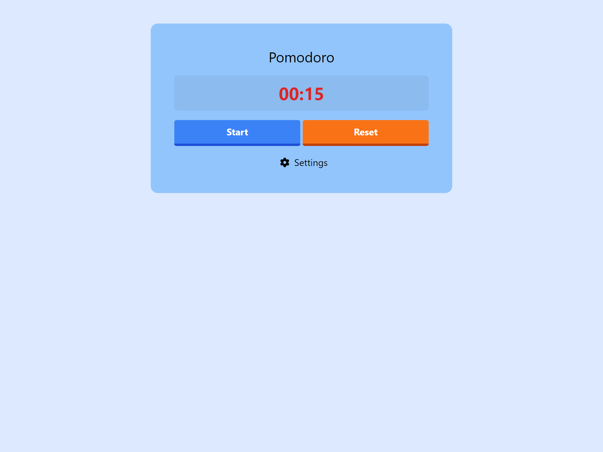
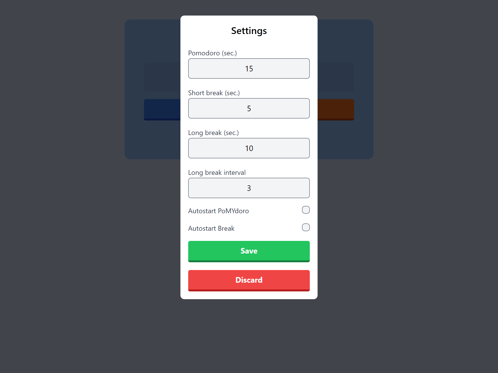
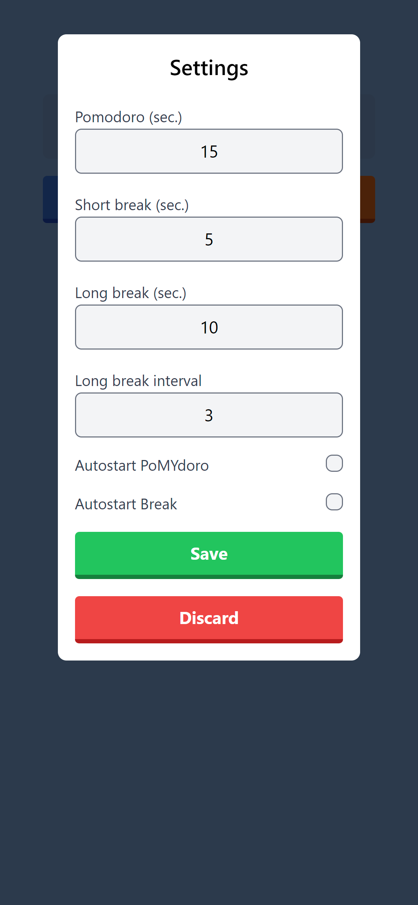

# poMYdoro

Personal project to implement Pomodoro timer in React with Typescript.

My main goal with this project was to try making custom hooks and tests.

## Demo

## Screenshots
### Desktop version

   
   

### Mobile version

   
   

## Technologies Used

- Vite
- Typescript
- React @18.2.0
- usehooks-ts @2.9.1
- Tailwind CSS
- Tailwind-elements

## How to run

1. Clone the repository `git clone git@github.com:xkosorin/poMYdoro.git`
   - If you are using npm delete `yarn.lock` file
2. Run `yarn install` or `npm install`
3. Run `yarn dev` or `npm run dev`
